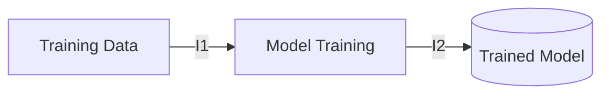
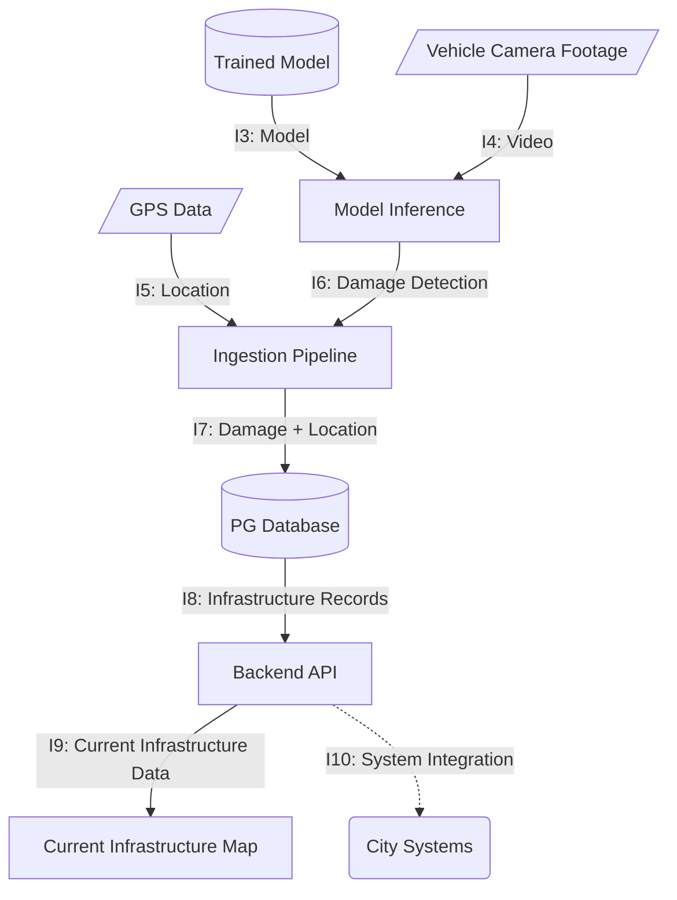
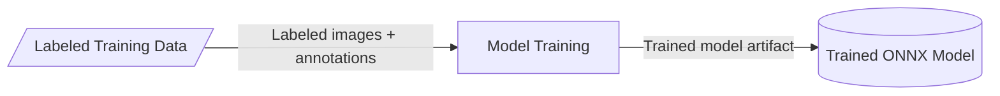
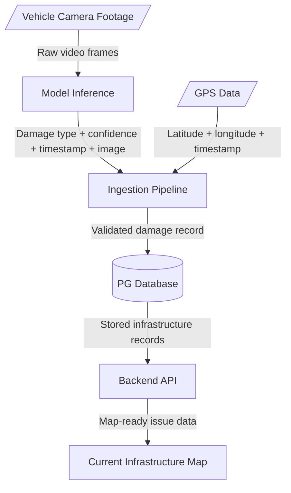

# StreetSmart - High-Level System Design (D0)

**Team Members:** Raihan Rafeek, Advait Vagerwal, Sahil Thakare

**Course:** CS 5001
**Assignment:** Design D0 - High-Level System Design
**Date:** 29 September 2026

---

# 1. Title, Goal Statement, and Conventions

## Goal Statement

StreetSmart is a system that uses vehicle-mounted camera footage to identify public infrastructure damage, geotag detected issues, and provide city personnel with a centralized map and database of infrastructure conditions.

### Basic Input

* Vehicle camera footage containing road and infrastructure imagery
* GPS/location information associated with the footage

### Basic Output

* Identified infrastructure issues with geographic coordinates and relevant metadata
* Map/database records that city personnel can review and act upon
* Authenticated UI and API based access to data

## Diagram Conventions
| Shape                 | Meaning                           |
| --------------------- | --------------------------------- |
| **Rectangle**         | StreetSmart component we build    |
| **Rounded rectangle** | External system/service           |
| **Cylinder**          | Persistent data storage/database  |
| **Parallelogram**     | Input/output data                 |
| **Arrow**             | Data/interface between components |
| **Dashed arrow**      | External integration              |
| `I1`, `I2`, etc.      | Interface ID                      |

---

# 2. Block Diagram





### Component Overview

| Component                      | Purpose                                                                                                    |
| ------------------------------ | ---------------------------------------------------------------------------------------------------------- |
| **Model Training**             | Trains the infrastructure-damage detection model using labeled vehicle and infrastructure imagery.         |
**Trained Model** | Model with fixed weights based on training, ready to identify potholes from video frames provided |
| **Model Inference**            | Uses the trained model to analyze vehicle camera footage and identify infrastructure damage.               |
| **Ingestion Pipeline**         | Combines damage detections with GPS location data and prepares the resulting information for storage.      |
| **PG Database**                | Stores infrastructure damage records, geographic coordinates, and associated metadata for later retrieval. |
| **Backend API**                | Provides infrastructure records to the map interface and supports integration with external city systems.  |
| **Current Infrastructure Map** | Displays detected infrastructure damage and its geographic locations for city users to review.             |

---

# 3. Component Responsibility Table

| Component                      | Responsibility                                                                                             | Interfaces In | Interfaces Out | Primary Owner |
| ------------------------------ | ---------------------------------------------------------------------------------------------------------- | ------------- | -------------- | ------------- |
| **Model Training**             | Trains and updates the infrastructure-damage detection model using labeled training data.                  | I1            | I2             | Advait Vagerwal           |
| **Trained Model**              | Stores the trained model used by the inference system for infrastructure-damage detection.                 | I2            | I3             | Advait Vagerwal           |
| **Model Inference**            | Processes vehicle camera footage using the trained model to identify infrastructure damage.                | I3, I4        | I6             | Raihan Rafeek           |
| **Ingestion Pipeline**         | Combines detected damage with GPS location data and prepares the resulting information for storage.        | I5, I6        | I7             | Sahil Thakare           |
| **PG Database**                | Stores infrastructure damage records, geographic coordinates, and associated metadata for later retrieval. | I7            | I8             | Sahil Thakare           |
| **Backend API**                | Provides infrastructure records to the map interface and supports integration with external city systems.  | I8            | I9, I10        | Raihan Rafeek, Sahil Thakare           |
| **Current Infrastructure Map** | Displays infrastructure damage and its geographic locations for users to review.                           | I9            | —              | Advait Vagerwal, Sahil Thakare           |

---

# 4. Interface Specification Table

| ID      | Interface                            | Inputs                              | Outputs                           | Data Format                 | Protocol                    | Error Handling                                                   |
| ------- | ------------------------------------ | ----------------------------------- | --------------------------------- | --------------------------- | --------------------------- | ---------------------------------------------------------------- |
| **I1**  | Training Data → Model Training       | Labeled images/annotations          | Training dataset                  | Images + annotation files   | File system / batch process | Invalid or missing labels are rejected/logged                    |
| **I2**  | Model Training → Trained Model       | Training data/configuration         | Trained model artifact            | ONNX model                  | File storage                | Training failure logged; previous valid model retained           |
| **I3**  | Trained Model → Model Inference      | Trained model                       | Loaded model                      | ONNX                        | Local file/model loading    | Model load failure prevents inference and logs error             |
| **I4**  | Camera → Model Inference             | Vehicle footage                     | Video frames                      | Video stream/file           | Local camera/file input     | Invalid/unreadable frames skipped or logged                      |
| **I5**  | GPS → Ingestion Pipeline             | Location readings                   | latitude, longitude, timestamp       | JSON/structured record      | Local device/API            | Missing or invalid coordinates rejected                          |
| **I6**  | Model Inference → Ingestion Pipeline | Video frames                         | Damage type, confidence, timestamp, image reference                | Structured JSON/object      | Internal process/API        | Invalid detections rejected/logged                               |
| **I7**  | Ingestion Pipeline → PG Database     | Damage type, confidence, latitude, longitude, timestamp, image reference        | Stored infrastructure record      | SQL row / structured record | PostgreSQL                  | Database errors logged and record write retried                  |
| **I8**  | PG Database → Backend API            | Stored infrastructure records       | Query results                     | JSON/structured data        | PostgreSQL connection       | Query/connection errors returned and logged                      |
| **I9**  | Backend API → Infrastructure Map     | Infrastructure records              | Map-ready issue data              | JSON                        | HTTP/REST                   | HTTP error returned to client                                    |
| **I10** | Backend API ↔ City Systems           | Infrastructure records/API requests | City-compatible records/responses | JSON                        | HTTP/REST                   | Authentication, validation, and connection errors handled by API |


## Example Payload

```json
{
  "id": "damage_00123",
  "type": "pothole",
  "confidence": 0.94,
  "latitude": 39.1031,
  "longitude": -84.5120,
  "timestamp": "2026-09-29T12:00:00Z",
  "image_url": "https://example.com/images/damage_00123.jpg"
}
```

# 5. Data-Flow Diagram

## Model Training Flow


## Runtime Detection Flow



StreetSmart has two primary data flows: a model training flow that produces the trained detection model, and a runtime detection flow that uses the model to identify and record infrastructure damage.

### Model Training Data Flow

1. **Training Data** - Labeled infrastructure imagery and annotations are provided to the model training process.
2. **Model Training** - The training component processes the labeled data to train an infrastructure damage detection model over a finite number of epochs.
3. **Trained Model** - The resulting model is exported as an ONNX model and made available to the Model Inference component.

### Runtime Data Flow

1. **Capture** - Vehicle-mounted cameras collect road and infrastructure footage while GPS provides the associated location information.
2. **Inference** - Model Inference processes video frames using the trained ONNX model and produces detected infrastructure issues, including damage type, confidence, and associated metadata.
3. **Ingestion** - The Ingestion Pipeline combines the detection results with GPS coordinates and other associated metadata.
4. **Storage** - The resulting validated infrastructure record is stored in the PostgreSQL database.
5. **API Access** - The Backend API retrieves infrastructure records and makes them available to client applications and external integrations.
6. **Visualization** - The Current Infrastructure Map uses the API data to display detected infrastructure issues at their geographic locations.

### Timing Requirements

For the scope of senior design, StreetSmart is not required to perform inference in real time. Captured footage can be processed by the inference pipeline and converted into infrastructure records for later review. Processing and API response times will be evaluated during implementation and refined based on system performance.

---
# 6. Architecture Pattern and Justification

## Selected Architecture Pattern(s)

### Pipeline

**Used for:**
Vehicle footage moves through a sequence of processing stages, beginning with video input and continuing through model inference, data ingestion, validation, and database storage. Each stage performs a specific task and passes its output to the next stage.

### Client-Server

**Used for:**
The Current Infrastructure Map acts as the client while the Backend API acts as the server. The client requests infrastructure data through the API rather than accessing the database directly. External city systems can also communicate with StreetSmart through API endpoints provided by the backend.

### Microservices

**Used for:**
The Backend API provides a separate service for retrieving infrastructure data from the PostgreSQL database and exposing it to the map interface and external city systems. Separate internal and external API endpoints allow the system to support the interactive map while also providing an integration point for existing or future city systems.

---

## Pattern Justification

### Fit to the Problem

The Pipeline pattern fits StreetSmart because infrastructure footage naturally moves through a sequence of processing stages from raw input to a stored infrastructure record. The Client-Server pattern separates the user-facing map and external-facing systems from the backend data and processing components. A separate set of internal APIs will be used to support the interactive map, while external-facing APIs provide an integration point for city systems. The Microservices pattern allows the backend API and data retrieval functionality to operate as a separate service, keeping API responsibilities separated from the model inference and data processing pipeline.

### Team Skills

The selected architecture aligns with the team's experience with machine learning, backend APIs, PostgreSQL, web applications, and REST interfaces. Separating the processing pipeline from the API also allows team members to work on different components independently. The architecture provides clear boundaries between machine learning, data processing, database access, and user-facing functionality.

### Performance and Timing

The pipeline allows computationally intensive model inference to operate independently from the API and map interface. Since real-time inference is not required for the senior design scope, footage can be processed and stored for later review. Separating the API from inference also prevents intensive model processing from directly affecting map data retrieval and user interaction.

### Scalability

The processing stages can be optimized independently. Additional inference processing can be added without changing the map or API, while the API can continue serving stored infrastructure records. Separating the backend API into its own service also allows additional API consumers, such as city systems, to be supported without requiring changes to the map interface or database structure.

### Hardware Constraints

A primary hardware constraint is obtaining accurate GPS coordinates associated with the recorded camera footage. The camera system must either provide location data directly or be paired with a separate GPS tracking module that records coordinates alongside the footage. The system must be able to associate GPS readings with the corresponding video timestamps so that detected infrastructure issues can be assigned geographic coordinates.

Model inference is separated from the user-facing application so that computationally intensive processing does not need to occur on the user's device. The trained ONNX model can be deployed to the available processing hardware while the map and API remain lightweight.

---

## Rejected Alternative

**Pattern considered:** Monolithic Architecture

**Why it was considered:**
A monolithic architecture could combine the model inference, ingestion pipeline, database access, API endpoints, and map functionality into a single application. This would simplify initial deployment and reduce the number of separately managed components.

**Why it was rejected:**
A monolithic architecture would make it more difficult to separate internal APIs used by the interactive map from external-facing APIs used for city system integration. It would also couple the computationally intensive inference and data processing components more closely with the API and user-facing functionality. Using a separate backend service provides clearer boundaries between these responsibilities and allows the API to be developed and scaled independently.