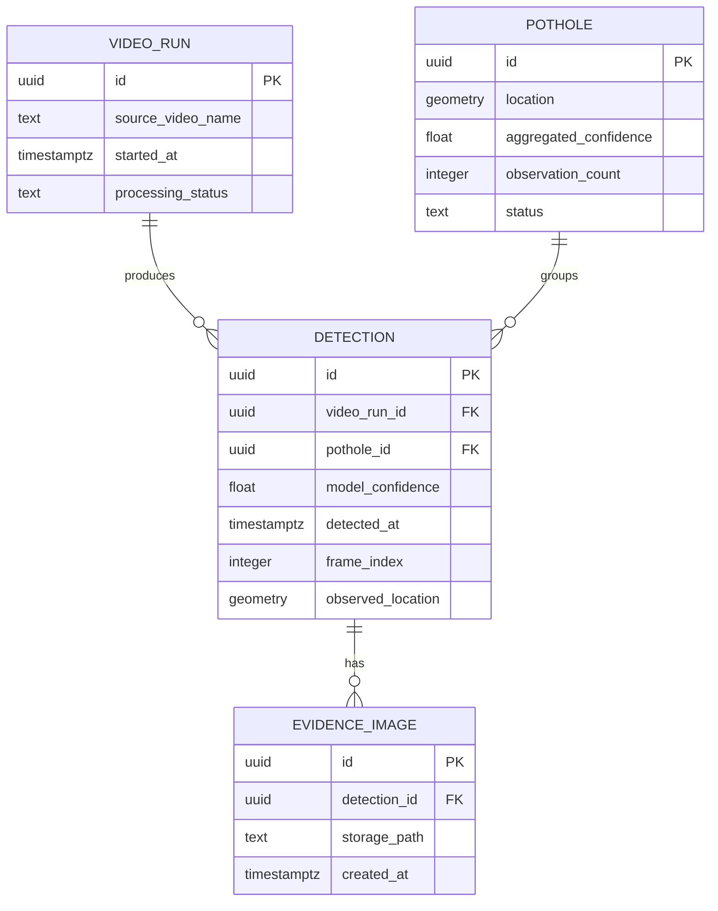

# StreetSmart: Detailed Design (D1)

**Team Members:** Advait Vagerwal, Sahil Thakare, Raihan Rafeek
**Course:** CS 5001 - Computer Science Senior Design
**Advisor:** Eric Jamison
**Assignment:** Design D1 - Detailed Design
**Date:** October 6, 2026
**Document Version:** 0.1

---

# 1. Header, Scope, and Conventions

## Project Title

**StreetSmart: Automated Public Infrastructure Damage Detection and Geospatial Reporting System**

## Goal Statement

StreetSmart is an automated public infrastructure inspection system that analyzes vehicle-mounted camera footage and synchronized GPS data to detect, geotag, and classify roadway damage such as potholes. The system provides municipal personnel and downstream city systems with a centralized geospatial database, interactive visualization dashboard, and standardized API integration to accelerate road maintenance and improve public transit safety.

## Scope

This document details the PostgreSQL/PostGIS database and evidence-image storage, the pothole confidence aggregation algorithm, and the algorithm for matching repeated detections of the same pothole. The Model Training, Trained Model Storage, Current Infrastructure Map, and municipal GIS integration components are deferred to D2.

## Diagram Conventions

* Rectangular boxes represent database entities and their attributes.
* `PK` identifies a primary key, which uniquely identifies a record.
* `FK` identifies a foreign key, which references a record in another entity.
* Arrows in system diagrams indicate the direction of data flow.
* Geographic coordinates use latitude and longitude in EPSG:4326.
* Image files are stored in Supabase Storage. PostgreSQL stores the paths used to retrieve those images.

---

# 2. Data Model, the D1 Diagram

## 2.1 Entity-Relationship Diagram

StreetSmart separates potholes from individual detections. A pothole can be detected across multiple frames or separate vehicle passes. Each detection records when and where it occurred, while the pothole record maintains the combined confidence score and overall location.



## 2.2 Entity Descriptions

| Entity           | Purpose                                                                                                                        |
| ---------------- | ------------------------------------------------------------------------------------------------------------------------------ |
| `VIDEO_RUN`      | Tracks a video-processing run, its source video, and its processing status.                                                    |
| `POTHOLE`        | Represents a unique pothole, including its estimated location, aggregated confidence, and number of observations.              |
| `DETECTION`      | Represents one observation of a pothole in a video frame, including its confidence, timestamp, frame number, and GPS location. |
| `EVIDENCE_IMAGE` | Stores the reference to an image of a detection, with the bounding box already rendered onto the image.                        |

## 2.3 Structural Decisions

| Decision                                         | Rationale                                                                                                                                                                                   |
| ------------------------------------------------ | ------------------------------------------------------------------------------------------------------------------------------------------------------------------------------------------- |
| Separate `POTHOLE` and `DETECTION` entities      | One physical pothole may appear in multiple frames. Keeping detections separate allows the system to retain individual confidence scores while updating the pothole's aggregate confidence. |
| Separate `VIDEO_RUN` entity                      | One video run can produce many detections. This makes it possible to trace a detection back to its source video.                                                                            |
| Separate `EVIDENCE_IMAGE` entity                 | A detection may have an associated evidence image. Storing the image reference separately keeps image metadata distinct from the detection record.                                          |
| Store rendered bounding boxes in evidence images | The bounding box is drawn directly onto the cropped image, so the system does not need to store the box coordinates separately for the prototype.                                           |
| Use PostgreSQL with PostGIS                      | A relational database supports structured records and relationships. PostGIS adds geographic operations needed to locate potholes and find nearby candidates.                               |
| Use Supabase Storage for images                  | Image files are stored separately from database records, reducing the amount of binary data stored directly in PostgreSQL.                                                                  |

## 2.4 Indexing Decisions

StreetSmart will use a spatial index on `POTHOLE.location` to speed up searches for potholes near a newly detected location. A spatial index helps PostGIS narrow down nearby candidates without checking every pothole in the database.

The system will also use the primary keys and foreign-key relationships to identify records and connect detections to their processing runs, potholes, and evidence images. Additional indexes can be considered if testing shows that queries are too slow.

## 2.5 Video and Evidence-Image Storage

1. The source video remains on persistent disk.
2. The Go inference service reads the video incrementally, loading individual frames into RAM rather than loading the entire video into memory.
3. Each frame is processed by the ONNX Runtime model.
4. When a pothole is detected, the system creates an evidence image with the bounding box rendered onto the image.
5. The system applies the required privacy redaction to faces and license plates before saving the evidence image.
6. The redacted image is uploaded to Supabase Storage.
7. PostgreSQL stores the detection details, associated pothole ID, and evidence-image storage path.

If an image upload fails, the system should report the failure rather than saving an image reference that cannot be retrieved.

---

# 3. Core Algorithms

## 3.1 Algorithm A: Weighted Pothole Confidence

### Purpose

A pothole may be detected multiple times as the vehicle moves along the road. This algorithm combines the model's confidence with the number of repeated detections to produce an overall confidence score for the pothole.

### Inputs and Outputs

| Parameter           | Type      | Description                                                               |
| ------------------- | --------- | ------------------------------------------------------------------------- |
| `model_confidence`  | `float64` | Average model confidence across accepted detections, between `0` and `1`. |
| `observation_count` | `int`     | Number of accepted detections associated with the pothole.                |
| `repeat_weight`     | `float64` | Weight assigned to the number of repeats, between `0` and `1`.            |

Output:

* `aggregated_confidence: float64`, between `0` and `1`.

### Equation

The aggregate confidence is calculated using a weighted linear equation:

$$
C_{\text{final}} =
(1-w)C_{\text{model}} + wC_{\text{repeat}}
$$

where:

* \(C_{\text{model}}\) is the average model confidence.
* \(C_{\text{repeat}}\) is the repeat score.
* \(w\) is the weight assigned to repeated detections.

For this prototype, the repeat score is the observation count normalized to the interval from `0` to `1`:

$$
C_{\text{repeat}} = \frac{n}{n+1}
$$

where \(n\) is the number of accepted observations.

For example, if the average model confidence is `0.90`, there are three observations, and the repeat weight is `0.30`, then:

$$
C_{\text{repeat}} = \frac{3}{4}=0.75
$$

$$
C_{\text{final}} = (0.70)(0.90)+(0.30)(0.75)=0.855
$$

The model confidence contributes most of the score, while repeated observations provide additional evidence.

> The actual weight for repeated detections will be confirmed upon testing and normalization.

### Complexity

The algorithm takes \(O(n)\) time to calculate the average from \(n\) observations. If the system maintains a running sum and observation count, updating the average and aggregate confidence for a new detection takes \(O(1)\) time. At 100 times the number of observations, calculating the average from scratch requires proportionally more work, but incremental updates remain constant-time.

### Why This Approach

A weighted linear equation is easy to implement, explain, and adjust during testing. Using model confidence alone ignores repeated observations, while using the number of observations alone ignores the model's prediction quality. The weighted equation incorporates both.

### Edge Cases

* **No observations:** Do not calculate an aggregate score until at least one valid detection exists.
* **Invalid confidence:** Reject confidence values outside `[0, 1]`.
* **Duplicate frames:** Avoid counting the same frame detection multiple times.
* **New detection:** Update the observation count and average confidence.
* **Invalid weight:** Reject values of `repeat_weight` outside `[0, 1]`.

## 3.2 Algorithm B: Match Repeated Detections to a Pothole

### Purpose

When the model detects a pothole, StreetSmart must decide whether it has already recorded that pothole or whether the detection represents a new pothole. Matching repeated detections prevents the system from creating a separate pothole record for every frame in which the same pothole appears.

### Inputs and Outputs

| Parameter           | Type                    | Description                                                                          |
| ------------------- | ----------------------- | ------------------------------------------------------------------------------------ |
| `observed_location` | Geographic point        | GPS location associated with the new detection.                                      |
| `existing_potholes` | List of pothole records | Existing potholes near the new detection.                                            |
| `matching_radius`   | `float64`               | Maximum geographic distance, in meters, for considering a pothole a potential match. |

Output:

* The ID of an existing pothole if a match is found.
* A new pothole record if no existing pothole is a suitable match.

### Approach

1. Receive a new detection and its GPS coordinates.
2. Query PostGIS for existing potholes within the configured matching radius.
3. If no candidates are found, create a new pothole record.
4. If one candidate is found, associate the detection with that pothole.
5. If multiple candidates are found, select the closest candidate only if it satisfies the matching rules. Otherwise, treat the match as ambiguous and avoid automatically merging the detections.
6. Update the pothole's observation count and aggregate confidence.

The matching radius will be selected based on the expected GPS accuracy and testing with representative footage.

### Complexity

A straightforward implementation that checks every stored pothole takes \(O(N)\) time for \(N\) existing potholes. Using PostGIS to search within a geographic radius reduces the number of candidates that need to be checked in typical cases. If the query returns \(k\) candidates, comparing their distances takes \(O(k)\) time.

At 100 times the number of stored potholes, checking every record would require approximately 100 times as many comparisons. The spatial query helps the system avoid that unnecessary work.

### Why This Approach

Geographic radius matching is straightforward to implement with PostGIS and does not require training another model or implementing a visual-odometry pipeline. It is suitable for the initial prototype and can be improved later if GPS-based matching proves insufficient.

### Edge Cases

* **Missing GPS:** Do not perform normal geographic matching when the location is unresolved.
* **No nearby potholes:** Create a new pothole record.
* **Multiple nearby potholes:** Avoid merging records when the correct match is ambiguous.
* **GPS inaccuracies:** A detection may be slightly displaced from the actual pothole location.
* **Duplicate processing:** Avoid counting the same frame detection twice.

---

# 4. Build-versus-Reuse Decisions

| Component                  | Build or Reuse                          | Library or Service                        | License / Terms                                   | Reason                                                                                                                   |
| -------------------------- | --------------------------------------- | ----------------------------------------- | ------------------------------------------------- | ------------------------------------------------------------------------------------------------------------------------ |
| Relational database        | Reuse                                   | PostgreSQL                                | PostgreSQL License                                | Provides reliable relational storage and structured queries.                                                             |
| Geographic operations      | Reuse                                   | PostGIS                                   | GPL-2.0-or-later; verify applicable obligations   | Provides geographic distance calculations and spatial queries without requiring the team to implement them from scratch. |
| Database and image hosting | Reuse                                   | Supabase                                  | Hosted-service terms and plan limits              | Reduces the infrastructure management needed for the prototype.                                                          |
| Model inference            | Reuse                                   | ONNX Runtime                              | MIT License                                       | Runs the trained model without requiring the team to implement its own inference engine.                                 |
| Video processing           | Reuse                                   | Video decoding library, to be selected    | To be verified                                    | Provides established video decoding and frame extraction.                                                                |
| Inference orchestration    | Build                                   | Go                                        | Go license and dependency licenses to be verified | Connects video frames, model inference, and detection output into the StreetSmart workflow.                              |
| Confidence aggregation     | Build                                   | Project implementation in Go              | Project license to be selected                    | Implements StreetSmart's weighted confidence equation.                                                                   |
| Pothole matching           | Build using PostGIS                     | Go and PostGIS                            | Verify dependency licenses                        | Implements the project's matching rules while reusing existing geographic operations.                                    |
| Evidence-image storage     | Reuse                                   | Supabase Storage API                      | Service terms and SDK license to be verified      | Stores image files separately from database records.                                                                     |
| Privacy redaction          | Reuse or integrate an existing solution | To be selected                            | To be verified                                    | Helps satisfy the requirement to redact faces and license plates before evidence is persisted.                           |
| HTTP and JSON handling     | Reuse                                   | Go standard library or selected framework | Verify selected dependencies                      | Avoids implementing common HTTP and JSON functionality from scratch.                                                     |

The selected libraries and services should be checked for active maintenance, documentation, license compatibility, performance, and fit with the team's implementation environment. Exact dependency versions and hosting limits should be recorded before the final submission.

---

# 5. API Contract

The D0 architecture defines an interface between Model Inference and the Ingestion Pipeline, followed by an interface between ingestion and PostgreSQL. The following contract describes the information that must pass through those boundaries.

The endpoints below are proposed examples. If inference and ingestion communicate through internal Go functions rather than HTTP, the same inputs and outputs can be implemented as internal method signatures.

## 5.1 Proposed Endpoints

| Method and Endpoint            | Inputs                                                                                                                                                                                                                                | Success Response                                                                                      | Error Responses                                                                                                                                                           |
| ------------------------------ | ------------------------------------------------------------------------------------------------------------------------------------------------------------------------------------------------------------------------------------- | ----------------------------------------------------------------------------------------------------- | ------------------------------------------------------------------------------------------------------------------------------------------------------------------------- |
| `POST /api/v1/processing-runs` | `source_video_name: string` required; `started_at: RFC3339 timestamp` required                                                                                                                                                        | `201`: `{ "run_id": "UUID", "status": "queued" }`                                                     | `400` invalid input; `500` database error; `503` database unavailable.                                                                                                    |
| `POST /api/v1/detections`      | `run_id: UUID`; `frame_index: integer >= 0`; `detected_at: RFC3339 timestamp`; `confidence: number in [0,1]`; `damage_type: string`; `latitude: number in [-90,90]`; `longitude: number in [-180,180]`; optional `image_path: string` | `201`: detection ID, pothole ID, aggregate confidence, and observation count                          | `400` malformed input; `404` unknown processing run; `409` duplicate detection; `422` invalid or unresolved coordinates; `500` database error; `503` service unavailable. |
| `GET /api/v1/potholes`         | Required geographic bounding box; optional `min_confidence: number in [0,1]`                                                                                                                                                          | `200`: list of potholes with IDs, coordinates, confidence, observation count, and evidence references | `400` invalid bounds or filters; `401` missing or invalid credentials if authentication is enabled; `503` database unavailable.                                           |
| `GET /api/v1/potholes/{id}`    | `id: UUID` required                                                                                                                                                                                                                   | `200`: pothole details and associated evidence references                                             | `400` invalid UUID; `404` pothole not found; `503` database unavailable.                                                                                                  |

## 5.2 Example Request and Response

Example request:

```http
POST /api/v1/detections
Content-Type: application/json
```

```json
{
  "run_id": "e32a71db-a9bf-4dc5-ae3d-57e16ed23c11",
  "frame_index": 14280,
  "detected_at": "2026-10-02T14:32:10.420Z",
  "damage_type": "pothole",
  "confidence": 0.942,
  "latitude": 39.132145,
  "longitude": -84.516028,
  "image_path": "runs/example-run/detections/example-detection.jpg"
}
```

Example success response:

```json
{
  "detection_id": "4a7f9218-c2b3-4f9e-a81d-6120531e21b0",
  "pothole_id": "f71f1e42-9b8d-47c8-8ed8-3f35f023be18",
  "aggregated_confidence": 0.942,
  "observation_count": 1
}
```

The values are illustrative. The implementation must generate the identifiers and calculate the aggregate confidence and observation count.

## 5.3 Evidence-Image Handling

Evidence images are uploaded to Supabase Storage after the bounding box is rendered and required privacy redaction is applied. The corresponding storage path is then associated with the detection in PostgreSQL. The API returns the image reference rather than embedding the image bytes in the response.

If image upload fails, the system should report the failure and avoid creating a broken evidence reference. The team must define how retries and partially completed uploads will be handled.

## 5.4 Versioning

The proposed API uses the `/api/v1` prefix. Removing or renaming fields, changing field types or units, or changing required inputs incompatibly constitutes a breaking change and requires a new API version.


---
# 6. Technology Choices with Justification

## 6.1 Database: PostgreSQL and PostGIS

PostgreSQL with PostGIS is the selected database approach because StreetSmart needs to store pothole records, individual detections, and image references while supporting geographic queries. **Team skill fit:** The relational data model fits the team's existing database development approach, and PostGIS extends PostgreSQL with the spatial operations needed for pothole matching. **Licensing:** PostgreSQL uses the PostgreSQL License, and PostGIS uses GPL-2.0-or-later. **Community support:** Both have established documentation and communities. **Performance:** Geographic queries help find nearby potholes without comparing every record individually. **Cost and hosting:** Both can run locally or through managed PostgreSQL hosting, keeping deployment flexible. MongoDB was considered as an alternative, but PostgreSQL/PostGIS better supports the project's relational relationships and geographic queries.

## 6.2 Image Storage: Supabase Storage

Supabase Storage is the selected service for storing rendered and redacted pothole evidence images, while PostgreSQL stores their paths. **Team skill fit:** Managed storage integrates with the project's existing Supabase-based infrastructure and avoids building a separate file-storage service. **Licensing:** The hosted service is governed by Supabase's service terms, while any SDK dependencies retain their respective licenses. **Community support:** Supabase provides documentation and examples for storage operations. **Performance:** Keeping image files outside database rows avoids storing large binary objects directly in PostgreSQL. **Cost and hosting:** Managed storage reduces infrastructure and maintenance work, with usage subject to plan limits. Self-hosted object storage was considered as an alternative, but it would add unnecessary operational overhead for the prototype.

## 6.3 Backend and Inference: Go

Go is the selected language for connecting video processing, ONNX inference, and the ingestion pipeline. **Team skill fit:** Go fits the current implementation direction and provides a lightweight way to coordinate video processing, inference, database writes, and storage uploads. **Licensing:** Go uses a BSD-style license, with additional dependencies requiring their own review. **Community support:** Go has a mature standard library for file processing, JSON, HTTP, and concurrency. On top of that, we are using Gin, which is a very well supported framework for server-side compute. **Performance:** Reading video incrementally allows the system to process frames without loading the entire video into memory. **Cost and hosting:** Go applications can run on existing development machines or standard Linux servers. Python was considered as an alternative because of its extensive machine-learning ecosystem, but Go is the chosen runtime language for the prototype.

## 6.4 Model Runtime: ONNX Runtime

ONNX Runtime is the inference runtime identified in D0. **Team skill fit:** ONNX Runtime fits the planned Go inference pipeline and allows the team to run a trained model without implementing inference from scratch. **Licensing:** ONNX Runtime uses the MIT License, while additional dependencies must be checked separately. **Community support:** The project provides documentation and supports common inference environments. **Performance:** It executes model inference on incoming frames while keeping model execution separate from the ingestion logic. **Cost and hosting:** It supports deployment on suitable local machines or servers, depending on model and hardware requirements. Native PyTorch inference was considered as an alternative, but ONNX Runtime better fits the prototype's planned runtime architecture.

## 6.5 Frontend and Hosting

D0 specifies a React dashboard for visualizing detected infrastructure damage, alongside a backend API and database. **Team skill fit:** React fits the team's web development stack and supports building an interactive map interface without implementing map rendering from scratch. **Licensing:** React uses the MIT License; the selected hosting platform is governed by its own service terms. **Community support:** React has a mature ecosystem and extensive documentation. **Performance:** The dashboard can request potholes within the visible map area instead of loading every record at once. **Cost and hosting:** A static frontend host and managed database reduce deployment effort, while local or university-provided infrastructure may reduce costs. Self-hosted Docker deployment remains an alternative if the project needs more control over its environment.
