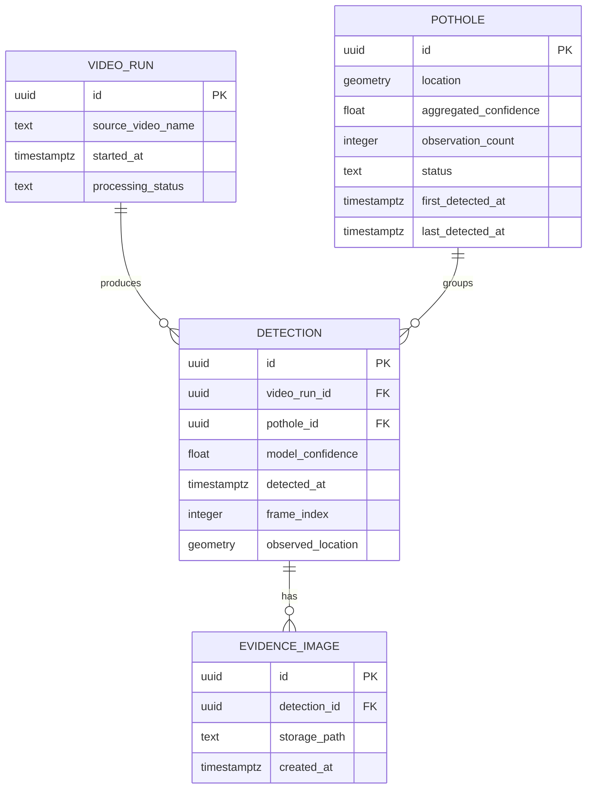

# StreetSmart: Detailed Design (D1)

**Team Members:** Advait Vagerwal, Sahil Thakare, Raihan Rafeek
**Course:** CS 5001 - Computer Science Senior Design
**Advisor:** Eric Jamison
**Assignment:** Design D1 - Detailed Design
**Date:** October 8, 2026
**Document Version:** 1.0

---

# 1. Header, Scope, and Conventions

## Project Title

**StreetSmart: Automated Public Infrastructure Damage Detection and Geospatial Reporting System**

## Goal Statement

StreetSmart is an automated public infrastructure inspection system that analyzes vehicle-mounted camera footage and synchronized GPS data to detect, geotag, and classify roadway damage such as potholes. The system provides municipal personnel and downstream city systems with a centralized geospatial database, interactive visualization dashboard, and standardized API integration to accelerate road maintenance and improve public transit safety.

## Scope

This document details the PostgreSQL/PostGIS database and evidence-image storage, the pothole confidence aggregation algorithm, and the spatial pothole matching algorithm. The Model Training, Trained Model Storage, Model Inference, and Current Infrastructure Map components are deferred to D2.

## Diagram Conventions

* Rectangular boxes represent database entities and their attributes.
* `PK` identifies a primary key, which uniquely identifies a record.
* `FK` identifies a foreign key, which references a record in another entity.
* Solid connector lines represent relationships between entities.
* Cardinality is drawn using standard crow's foot notation on both ends (`||--o{`), where `||` indicates exactly one and `o{` indicates zero, one, or many.
* Geographic coordinates use latitude and longitude in EPSG:4326 (WGS84).
* Image files are stored in Supabase Storage, and PostgreSQL stores the relative paths used to retrieve those images.

---

# 2. Data Model, the D1 Diagram

## 2.1 Entity-Relationship Diagram

StreetSmart separates potholes from individual detections. A pothole can be detected across multiple frames or separate vehicle passes. Each detection records when and where it occurred, while the pothole record maintains the combined confidence score and overall location.



## 2.2 Entity Descriptions

| Entity | Purpose |
| --- | --- |
| `VIDEO_RUN` | Tracks a video-processing run, its source video, and its processing status. |
| `POTHOLE` | Represents a unique pothole, including its estimated location, aggregated confidence, observation count, and status. |
| `DETECTION` | Represents one observation of a pothole in a video frame, including its confidence, timestamp, frame number, and GPS location. |
| `EVIDENCE_IMAGE` | Stores the reference to an image of a detection, with the bounding box already rendered onto the image. |

## 2.3 Structural Decisions

| Decision | Rationale | Requirement IDs |
| --- | --- | --- |
| Separate `POTHOLE` and `DETECTION` entities | One physical pothole may appear in multiple frames or separate passes. Keeping detections separate preserves individual confidence scores and timestamps while updating the pothole's aggregate confidence. | US-01, US-02, US-03, AC-01.1 |
| Separate `VIDEO_RUN` entity | One video run can produce many detections. Tracking run metadata separately avoids duplicating video names across rows and makes it possible to trace a detection back to its source video. | US-01, AC-01.1, AC-01.2 |
| Separate `EVIDENCE_IMAGE` entity | A detection may have an associated evidence image. Storing the image reference separately keeps image metadata distinct from the detection record. | US-04, AC-01.1 |
| `VIDEO_RUN` to `DETECTION` is one-to-many | A video run produces many detections, but each detected frame comes from exactly one video file. | US-01, AC-01.1 |
| `POTHOLE` to `DETECTION` is one-to-many | A pothole groups multiple observations over time, but each observation belongs to only one physical pothole. | US-02, US-03, AC-01.1 |
| `DETECTION` to `EVIDENCE_IMAGE` is one-to-many | A detection can have zero or more evidence images, and each image belongs to a specific detection event. | US-04, AC-01.1 |
| Store rendered bounding boxes in evidence images | The bounding box is drawn directly onto the cropped image, so the system does not need to store the box coordinates separately for the prototype. | US-01, AC-01.1 |
| Use PostgreSQL with PostGIS over a simpler store | A relational database enforces foreign-key relationships between runs, detections, and potholes. PostGIS provides standard spatial indexing and geometric distance queries needed for pothole matching, which simpler key-value or document stores do not support natively. | US-01, US-02, US-05, AC-02.1 |
| Use Supabase Storage for images | Image files are stored separately from database records, reducing the amount of binary data stored directly in PostgreSQL rows. | US-04, AC-01.1 |

## 2.4 Indexing Decisions

StreetSmart uses the following indexes to keep queries fast as data grows:

* `POTHOLE.location`: PostGIS spatial index (GiST). Allows fast searches for potholes within a 5-meter radius during matching and supports bounding-box queries for the map dashboard without scanning every row (US-01, US-05, AC-02.1).
* `DETECTION.pothole_id`: B-Tree index. Speeds up finding all detections for a specific pothole when recalculating aggregate confidence (US-02, AC-01.1).
* `DETECTION.video_run_id`: B-Tree index. Speeds up run-level queries, status checks, and data cleanup (US-01, AC-01.2).
* `POTHOLE.aggregated_confidence`: B-Tree index. Speeds up filtering potholes by minimum confidence threshold (such as 0.70) (US-02, AC-01.1, AC-02.1).
* `POTHOLE.status`: B-Tree index. Allows fast filtering by status (such as unresolved vs. repaired) for maintenance reviews (US-01, US-03).

## 2.5 Video and Evidence-Image Storage

1. The source video remains on persistent disk.
2. The Go inference service reads the video incrementally, loading individual frames into RAM rather than loading the entire video into memory.
3. Each frame is processed by the ONNX Runtime model.
4. When a pothole is detected, the system creates an evidence image with the bounding box rendered onto the image.
5. The system applies the required privacy redaction to faces and license plates before saving the evidence image.
6. The redacted image is uploaded to Supabase Storage.
7. PostgreSQL stores the detection details, associated pothole ID, and evidence-image storage path.

If an image upload fails, the system reports the failure rather than saving an image reference that cannot be retrieved.

---

# 3. Core Algorithms

## 3.1 Algorithm A: Weighted Pothole Confidence

### Purpose

A pothole may be detected multiple times as the vehicle moves along the road. This algorithm combines the model's confidence with the number of repeated detections to produce an overall confidence score for the pothole.

### Inputs and Outputs

| Parameter | Type | Description |
| --- | --- | --- |
| `model_confidence` | `float64` | Average model confidence across accepted detections, between 0 and 1. |
| `observation_count` | `int` | Number of accepted detections associated with the pothole. |
| `repeat_weight` | `float64` | Weight assigned to the number of repeats, between 0 and 1 (default 0.30). |

Output:

* `aggregated_confidence`: `float64`, between 0 and 1.

### Equation

The aggregate confidence is calculated using a weighted linear equation:

C_final = (1 - w) * C_model + w * C_repeat

where:

* C_model is the average model confidence across accepted detections.
* C_repeat is the repeat score.
* w is the weight assigned to repeated detections.

For this prototype, the repeat score is the observation count normalized to the interval from 0 to 1:

C_repeat = n / (n + 1)

where n is the number of accepted observations.

For example, if the average model confidence is 0.90, there are three observations, and the repeat weight is 0.30, then:

C_repeat = 3 / (3 + 1) = 0.75
C_final = (0.70) * (0.90) + (0.30) * (0.75) = 0.630 + 0.225 = 0.855

The model confidence contributes most of the score, while repeated observations provide additional evidence.

### Complexity

The algorithm takes O(n) time to calculate the average from n observations. If the system maintains a running sum and observation count, updating the average and aggregate confidence for a new detection takes O(1) time (< 0.05 microseconds).

For a typical 60-minute drive, a pothole is visible across 3 to 15 frames (realistic size n = 10). At 100 times this size (n = 1,000 observations over a year of repeated passes), calculating the average from scratch takes O(1,000), which completes in under 10 microseconds. With incremental updates, it remains O(1). The difference does not matter in practice because microsecond calculations are negligible compared to video inference (~15 ms) and network requests.

### Why This Approach

A weighted linear equation is easy to implement, explain, and adjust during testing. Using model confidence alone ignores repeated observations, while using the number of observations alone ignores the model's prediction quality. The weighted equation incorporates both.

Alternatives considered:

* Simple average: Passed over because a single detection with high confidence would score the same as a pothole confirmed across 10 passes.
* Bayesian updating: Passed over because consecutive video frames are not independent, which causes Bayesian probability to artificially jump to near 1.0 too quickly.
* Maximum confidence: Passed over because it is vulnerable to occasional false-positive spikes from the model.

### Edge Cases

* **No observations (n = 0):** Do not calculate an aggregate score until at least one valid detection exists (AC-01.1).
* **First observation (n = 1):** With n = 1, C_repeat = 0.50. For a 0.90 detection, C_final = 0.7(0.9) + 0.3(0.5) = 0.78, which cleanly passes the 0.70 threshold (AC-01.1).
* **Invalid confidence:** Reject confidence values outside [0, 1] at the ingestion boundary (Interfaces I6, I7).
* **Duplicate frames:** Avoid counting the same frame detection multiple times by checking (video_run_id, frame_index) (AC-01.1).
* **Invalid weight:** Reject values of repeat_weight outside [0, 1].
* **Observation saturation (n -> large):** As n increases, C_repeat approaches 1.0, keeping the score bounded within [0, 1] without overflow.
* **Lower confidence on repeated passes:** If later observations have lower confidence, the average confidence drops, appropriately lowering the aggregate score (US-02).

---

## 3.2 Algorithm B: Match Repeated Detections to a Pothole

### Purpose

When the model detects a pothole, StreetSmart must decide whether it has already recorded that pothole or whether the detection represents a new pothole. Matching repeated detections prevents the system from creating a separate pothole record for every frame in which the same pothole appears.

### Inputs and Outputs

| Parameter | Type | Description |
| --- | --- | --- |
| `observed_location` | Geographic point | GPS location associated with the new detection (lat in [-90, 90], lon in [-180, 180]). |
| `existing_potholes` | List of pothole records | Existing potholes near the new detection. |
| `matching_radius` | `float64` | Maximum geographic distance, in meters, for considering a pothole a potential match (default 5.0 meters). |

Output:

* The ID of an existing pothole if a match is found.
* A new pothole record if no existing pothole is a suitable match.

### Approach

1. Receive a new detection and its GPS coordinates.
2. Query PostGIS for existing potholes within the configured matching radius (5.0 meters):
   ```sql
   SELECT id, location, aggregated_confidence, observation_count
   FROM POTHOLE
   WHERE ST_DWithin(location::geography, ST_SetSRID(ST_MakePoint($lon, $lat), 4326)::geography, 5.0)
   ORDER BY ST_Distance(location::geography, ST_SetSRID(ST_MakePoint($lon, $lat), 4326)::geography) ASC;
   ```
3. If no candidates are found, create a new pothole record.
4. If one candidate is found, associate the detection with that pothole and update its observation count and aggregate confidence.
5. If multiple candidates are found, check the distance to the closest candidates. If one is clearly closest (d1 < 2.0 m and d2 - d1 >= 1.5 m), associate with that record. If the candidates are equidistant (|d2 - d1| < 1.0 m), flag the match as ambiguous to avoid corrupting records.
6. Update the pothole's observation count and aggregate confidence.

### Complexity

A straightforward implementation that checks every stored pothole takes O(N) time for N existing potholes. Using PostGIS to search within a geographic radius uses a spatial GiST index, which takes O(log N) time to find candidates, followed by checking the k returned candidates (O(k)).

At a realistic city size of N = 25,000 potholes, PostGIS evaluates the spatial tree in roughly 15 checks (< 0.8 ms). At 100 times that size (N = 2,500,000 records across a state or multi-year dataset), the spatial index tree depth increases by only about 7 levels, taking < 1.5 ms. The difference does matter here: without the spatial index, checking 2,500,000 records sequentially would take hundreds of milliseconds per frame and break the 20-minute video processing budget (AC-01.1). With the GiST index, the lookup remains fast.

### Why This Approach

Geographic radius matching is straightforward to implement with PostGIS and directly matches the GPS accuracy specification of 5 meters (AC-01.1).

Alternatives considered:

* Visual feature re-identification: Passed over because asphalt road surfaces have low visual distinctiveness under varying sunlight, and running a secondary neural network for image matching adds 50+ ms per candidate, slowing down batch video processing.
* Fixed grid binning (such as Geohash): Passed over because potholes located close to cell boundaries fail to match detections across the line unless adjacent cell queries are implemented.

### Edge Cases

* **Missing or unresolved GPS:** If coordinates are null or invalid, do not perform spatial matching. Flag the record as `LOCATION_UNRESOLVED` and return an HTTP 422 error within 3.0 seconds (AC-01.2, Interfaces I5, I7).
* **No nearby potholes (k = 0):** Create a new pothole record with initial values (US-01, AC-01.1).
* **Multiple nearby potholes / ties:** Select the closest only if clear. If ambiguous, flag as ambiguous to prevent incorrectly merging distinct nearby potholes (US-02).
* **Consecutive frames in same run:** Merge detections from adjacent frames into the same pothole without double-counting observation tallies if the vehicle was stationary (AC-01.1).
* **GPS jumps:** If a momentary GPS error displaces a point by more than 5 meters, it is treated as a separate record rather than distorting the true pothole location (US-02).

---

# 4. Build-versus-Reuse Decisions

| Component | Build or Reuse | Library or Service | License | Reason |
| --- | --- | --- | --- | --- |
| Relational database | Reuse | PostgreSQL 16 | PostgreSQL License | Provides reliable relational storage, ACID transactions, and structured queries. |
| Geographic operations | Reuse | PostGIS 3.4 | GPL-2.0-or-later | Provides spatial distance calculations, radius queries, and GiST indexing. |
| Database and image hosting | Reuse | Supabase | Apache-2.0 / Hosted Terms | Managed PostgreSQL and file storage reduces infrastructure setup for the prototype. |
| Model inference | Reuse | ONNX Runtime (Go binding) | MIT License | Runs the trained model efficiently without building a custom inference engine. |
| Video processing | Reuse | GoCV / OpenCV 4 | Apache-2.0 | Provides mature video decoding, frame extraction, and image manipulation. |
| Web framework | Reuse | Gin Web Framework | MIT License | Provides fast HTTP routing and JSON serialization for REST API endpoints. |
| GeoJSON handling | Reuse | `paulmach/orb` | MIT License | Provides geometry parsing and standard RFC 7946 GeoJSON serialization. |
| Privacy redaction | Reuse | Haar Cascade / lightweight YOLO | MIT License | Redacts pedestrian faces and license plates before images are stored (US-04). |
| Object storage client | Reuse | Supabase Go Storage SDK | MIT License | Handles multipart image uploads and signed URL generation. |
| Date and math utilities | Reuse | Go standard library (`time`, `math`) | BSD-3-Clause | Uses standard RFC 3339 timestamp parsing and coordinate math. |
| Inference orchestration | Build | Custom Go service (`internal/ingestion`) | Project License | Connects video frames, model inference, and detection output into the StreetSmart workflow. |
| Confidence aggregation | Build | Custom Go module (`internal/scoring`) | Project License | Implements StreetSmart's weighted confidence equation. |
| Pothole matching | Build using PostGIS | Custom Go module (`internal/matcher`) | Project License | Implements the 5-meter deduplication and matching rules using PostGIS queries. |

All candidate libraries have been checked for active maintenance, permissive licensing, and fit with the Go and PostgreSQL environment.

---

# 5. API Contract

The D0 architecture defines an interface between Model Inference and the Ingestion Pipeline, followed by an interface between ingestion and PostgreSQL. The following contract describes the key endpoints for the detailed components.

## 5.1 Key Endpoints

| Method and Endpoint | Inputs | Success Response | Error Responses |
| --- | --- | --- | --- |
| `POST /api/v1/runs` | `source_video_name: string` (required, 1-255 chars); `started_at: string` (required, RFC 3339); optional `device_id: string` | `201 Created`: `{ "run_id": "UUID", "status": "QUEUED", "started_at": "RFC 3339" }` | `400` invalid input; `409` duplicate run name; `500` database error; `503` database unavailable. |
| `POST /api/v1/detections` | `run_id: UUID` (required); `frame_index: int >= 0` (required); `detected_at: RFC 3339` (required); `model_confidence: float in [0, 1]` (required); `damage_type: string` ("pothole"); `latitude: float in [-90, 90]` (required); `longitude: float in [-180, 180]` (required); optional `image_path: string` | `201 Created`: `{ "detection_id": "UUID", "pothole_id": "UUID", "match_action": "MERGED", "aggregated_confidence": float in [0,1], "observation_count": int, "distance_to_centroid_meters": float }` | `400` malformed JSON; `404` unknown run ID; `409` duplicate frame index; `422` invalid or unresolved GPS (AC-01.2); `500` database error; `503` service unavailable. |
| `GET /api/v1/potholes` | Required query `bbox: string` (`min_lon,min_lat,max_lon,max_lat` in EPSG:4326 degrees); optional `min_confidence: float in [0, 1]` (default 0.70); optional `status: string` (default "ALL"); optional `limit: int in [1, 500]` (default 100) | `200 OK`: RFC 7946 GeoJSON FeatureCollection with pothole features containing IDs, coordinates, aggregated confidence, observation count, status, dates, and evidence image URLs. | `400` invalid or out-of-range bbox coordinates (returned in < 1.0s, AC-02.2); `401` unauthorized; `503` database unavailable. |
| `GET /api/v1/potholes/{id}` | `id: UUID` (required path parameter) | `200 OK`: `{ "id": "UUID", "location": { "latitude": float, "longitude": float }, "aggregated_confidence": float, "observation_count": int, "status": string, "first_detected_at": "RFC 3339", "last_detected_at": "RFC 3339", "evidence_images": [ { "image_id": "UUID", "storage_url": "string", "captured_at": "RFC 3339" } ] }` | `400` invalid UUID format; `404` pothole not found; `503` database unavailable. |

## 5.2 Example Request and Response

Example request:

```http
POST /api/v1/detections
Content-Type: application/json
```

```json
{
  "run_id": "e32a71db-a9bf-4dc5-ae3d-57e16ed23c11",
  "frame_index": 14280,
  "detected_at": "2026-10-02T14:32:10.420Z",
  "damage_type": "pothole",
  "model_confidence": 0.942,
  "latitude": 39.132145,
  "longitude": -84.516028,
  "image_path": "runs/example-run/detections/example-detection.jpg"
}
```

Example success response:

```json
{
  "detection_id": "4a7f9218-c2b3-4f9e-a81d-6120531e21b0",
  "pothole_id": "f71f1e42-9b8d-47c8-8ed8-3f35f023be18",
  "match_action": "MERGED",
  "aggregated_confidence": 0.855,
  "observation_count": 3,
  "distance_to_centroid_meters": 1.42
}
```

The values are illustrative. The implementation generates the identifiers and calculates the aggregate confidence and observation count.

## 5.3 Evidence-Image Handling

Evidence images are uploaded to Supabase Storage after the bounding box is rendered and required privacy redaction is applied. The corresponding storage path is then associated with the detection in PostgreSQL. The API returns the image reference rather than embedding raw image bytes in the response.

If an image upload fails, the system reports the failure and avoids creating a broken evidence reference in the database.

## 5.4 Versioning

The API uses the `/api/v1` prefix. Removing or renaming fields, changing field types or coordinate units, or adding mandatory request parameters constitutes a breaking change and requires incrementing the API version to `/api/v2`.

---

# 6. Technology Choices with Justification

## 6.1 Database: PostgreSQL and PostGIS

PostgreSQL with PostGIS is the chosen database for StreetSmart to store pothole records, individual detections, and image references while supporting geographic queries.

**Team skill fit:** Raihan has experience with database design, software development, and backend engineering. This allows the team to design the relational schema, write spatial queries, and configure PostGIS indexes without an unnecessary learning curve.

**Licensing:** PostgreSQL is licensed under the PostgreSQL License, and PostGIS is licensed under GPL-2.0-or-later. Both allow the team and municipality to use the software without commercial license fees.

**Community support:** Both tools have mature documentation, extensive tutorials, and active communities for spatial database issues.

**Performance:** PostGIS spatial indexes (GiST) allow the system to search for nearby potholes within a 5-meter radius in O(log N) time instead of checking every stored pothole.

**Cost and hosting:** PostgreSQL and PostGIS can run locally during development or on Supabase's hosted tier, keeping deployment costs low.

MongoDB was considered as an alternative, but PostgreSQL/PostGIS was chosen because it enforces relational foreign keys between runs, detections, and potholes, and provides standardized spatial query functions that MongoDB lacks.

## 6.2 Backend Language and Framework: Go and Gin

Go using the Gin framework is the chosen language and backend framework for the ingestion pipeline and REST API.

**Team skill fit:** Raihan is an experienced backend engineer and software developer, making Go a natural fit for writing the ingestion pipeline and database integrations. Sahil's DevOps background also helps with building containerized Go binaries for deployment.

**Licensing:** Go uses a BSD-3-Clause license and Gin uses the MIT License, both of which are permissive open-source licenses.

**Community support:** Go and Gin have extensive documentation, strong standard libraries for HTTP and JSON handling, and active developer support.

**Performance:** Go compiles to a native binary and uses lightweight goroutines, allowing the service to handle incoming video frames and concurrent GPS data efficiently with low memory usage.

**Cost and hosting:** Go binaries have small resource footprints and can run on low-cost virtual servers or university-provided Linux machines without requiring expensive hardware.

Python with FastAPI was considered as an alternative. While Python is popular for machine learning, Go was chosen for the ingestion service because of its lower memory overhead and simpler deployment as a single compiled binary.

## 6.3 Front End: React with TypeScript

React with TypeScript is the chosen frontend framework for the Current Infrastructure Map dashboard.

**Team skill fit:** Sahil specializes in frontend development and UI/UX design. This experience allows Sahil to design an accessible, user-friendly interface that lets municipal staff view detected damage and filter potholes easily.

**Licensing:** React and TypeScript are both licensed under the MIT License, allowing unrestricted academic and municipal use.

**Community support:** React is one of the most widely used web frameworks, with extensive component libraries, tutorials, and mature mapping packages such as MapLibre GL.

**Performance:** React's component model and virtual DOM render updates smoothly, and map vector rendering can load potholes within the active viewport rather than loading all records across the city at once.

**Cost and hosting:** The compiled frontend is composed of static files that can be hosted for free on platforms like Vercel or GitHub Pages, eliminating extra hosting expenses.

Leaflet with vanilla JavaScript was considered as an alternative, but React with TypeScript was chosen to provide compile-time type safety for API data models and a cleaner component structure for the dashboard.

## 6.4 Hardware and Model Runtime: Dashcam Footage with ONNX Runtime

StreetSmart uses vehicle dashcam footage processed asynchronously on workstation hardware with Microsoft ONNX Runtime.

**Team skill fit:** Advait is experienced with training machine learning models and fine-tunes the YOLO detection model in PyTorch before exporting it to ONNX format. Raihan then connects the exported ONNX model into the Go inference pipeline.

**Licensing:** ONNX Runtime is open-source under the MIT License.

**Community support:** ONNX Runtime is actively maintained by Microsoft and supported by major hardware vendors, offering clear documentation and pre-built binaries across platforms.

**Performance:** ONNX Runtime optimizes model execution on available hardware (CUDA on NVIDIA GPUs or vectorized CPU execution), enabling the pipeline to process a 60-minute video in under 20 minutes to meet AC-01.1.

**Cost and hosting:** Processing dashcam footage in batch on local workstation GPUs avoids purchasing expensive edge computing modules (such as NVIDIA Jetson units) for each municipal vehicle and eliminates ongoing cellular data streaming costs.

Direct PyTorch model execution was considered as an alternative, but ONNX Runtime was chosen because it decouples model training from the inference runtime and avoids installing the full PyTorch framework in production.

## 6.5 Hosting: Supabase and Docker

Supabase is used for managed database and image storage hosting, alongside Docker containers for backend services.

**Team skill fit:** Sahil has experience with DevOps and Docker containerization, while Raihan manages database schema operations. This allows the team to package services consistently and deploy them cleanly.

**Licensing:** Docker engine tools use the Apache-2.0 license, and Supabase's open-source stack is licensed under Apache-2.0 alongside its cloud platform terms.

**Community support:** Both Docker and Supabase have large developer communities, clear setup guides, and active support channels.

**Performance:** Docker ensures consistent runtime environments across developer machines and servers, while Supabase provides co-located PostgreSQL storage and connection pooling for low-latency queries.

**Cost and hosting:** Supabase provides a free tier that covers the database and storage requirements for the prototype, and Docker containers can be hosted on a low-cost virtual private server (around $5/month) or free university servers.

Full enterprise AWS deployment (RDS, S3, ECS) was considered as an alternative, but Supabase and Docker were chosen to avoid excessive configuration complexity and high recurring cloud bills for the project prototype.
