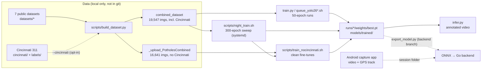

# Code Overview

## Purpose

This repo (`StreetSmart-models`, GitHub `Advaitvag/StreetSmart-models`) holds the **machine-learning side of StreetSmart**:

- building a single-class (`pothole`) detection dataset from public sources
- training and comparing YOLO detectors
- running them on dashcam video

Two other parts of the system live on unmerged branches:

| Branch | What | Note |
| --- | --- | --- |
| `main` | Dataset tooling, training, inference, trained weights, these docs | this checkout |
| `android-capture-app` (local) | StreetSmart Capture: an Android app that records road video + GPS | [[Android_Capture_App]] |
| `origin/backend_pipeline` | Go + Gin backend scaffold, ONNX Runtime inference stub, `.pt → .onnx` export | [[Backend_Pipeline]] |
| `origin/sd-submission-docs` | Senior-design submission documents | not code |

## How it works

Steps from data to detections:

1. **Dataset.** `build_dataset.py` merges seven public YOLO-format datasets (plus Cincinnati 311 if asked) into one train/val split with class `0: pothole`. → [[Dataset_Builder]]
2. **Training.** Ultralytics YOLO, run three ways: the `train.py` CLI for one-off runs, a nightly systemd sweep that compares four architectures at 300 epochs, and a Cincinnati-free fine-tuning script. → [[Training]]
3. **Evaluation.** The accuracy to report is measured on a Cincinnati-free, leak-free held-out set. → [[Models_and_Accuracy]]
4. **Inference.** `infer.py` runs one or more weight files over test videos and writes annotated MP4s plus an FPS/detection summary. → [[Inference]]
5. **Downstream** (other branches). The phone app records video + a GPS track on a shared clock. The Go backend will run the exported ONNX model and place each detection on the map.

## Repository layout (`main`)

| Path | What | Tracked |
| --- | --- | --- |
| `train.py` | Ultralytics training CLI | yes |
| `infer.py` | Batch inference CLI (videos/images → annotated output) | yes |
| `scripts/build_dataset.py` | Builds the combined dataset | yes |
| `scripts/night_train.sh` | Overnight 4-model sweep | yes |
| `scripts/train_nocincinnati.sh` | Cincinnati-free fine-tuning | yes |
| `queue_yolo26s.sh`, `queue_yolo26m.sh` | Legacy one-shot training launchers (superseded by `train.py`) | yes |
| `systemd/streetsmart-night*.{service,timer}` | User timers for the night sweep | yes |
| `models/` | Curated pretrained + trained weights (Git LFS) | yes |
| `runs/` | Raw run output: weights, `results.csv`, plots, logs (videos excluded) | yes |
| `docs/` | `BUILDING_THE_DATASET.md`, `NIGHT_TRAINING.md`, design specs/plans | ignored by `.gitignore` (`/docs`) but present locally |
| `StreetSmart_docs/` | Obsidian vault: senior-design docs + this Code section | yes |
| `datasets/`, `cincinnati/`, `labels/` | Image data | **no** (large; Cincinnati is never uploaded) |
| `android/` (on `main`) | Leftover Gradle build output only. The source is on `android-capture-app`. | untracked |
| `/yolo*.pt` | Stock COCO weights | no |

## Tech stack

- Python 3.12 venv; `torch 2.10.0` (CUDA 12.8), `torchvision 0.25.0`, `ultralytics 8.4.9`, `huggingface_hub`
- Hardware used: NVIDIA RTX 5060 Laptop GPU (8 GB). Batch sizes (16 for `s` models, 8 for `m` models) are chosen for it.
- Git LFS for `*.pt` / `*.pth` and plots
- systemd **user** units + `notify-send` for unattended training

## Licensing constraints

- Code: MIT.
- Combined dataset: aggregate licensing (ODbL / CC BY / CC BY-SA / MIT per source). Project-added files are CC BY-SA 4.0. See `docs/BUILDING_THE_DATASET.md`.
- **Cincinnati 311 imagery is never redistributed or uploaded.** It is opt-in at build time. Its labels are ML-generated and may be inaccurate, so it is also excluded from reported accuracy.

## Related

- [[Setup]] · [[Dataset_Builder]] · [[Training]] · [[Inference]] · [[Models_and_Accuracy]] · [[Android_Capture_App]] · [[Backend_Pipeline]] · [[Known_Issues]]
